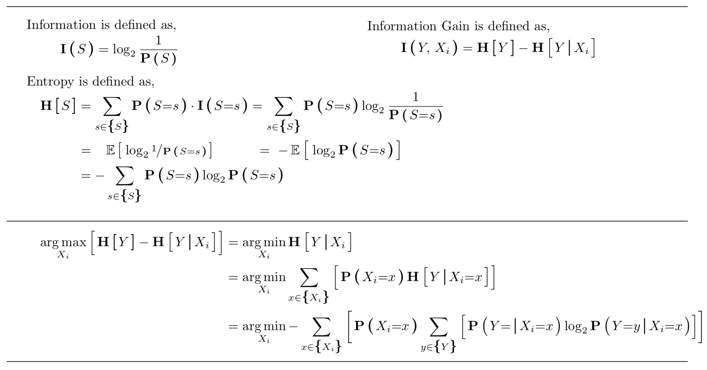
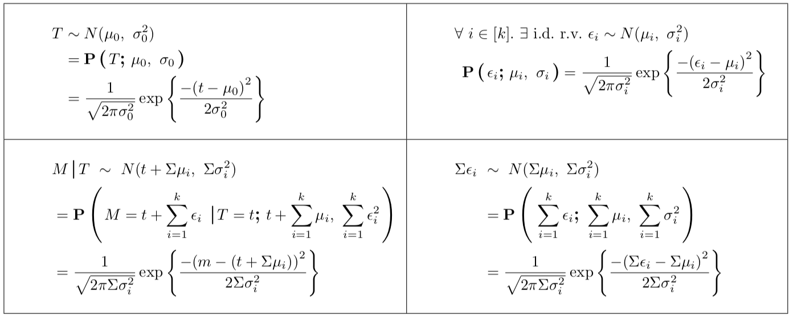
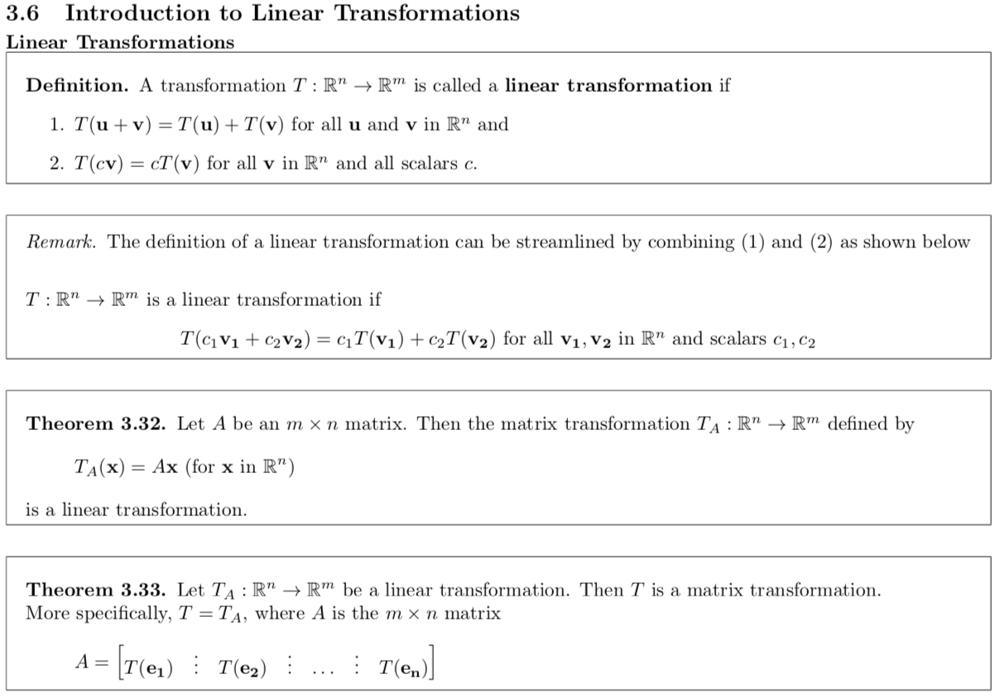
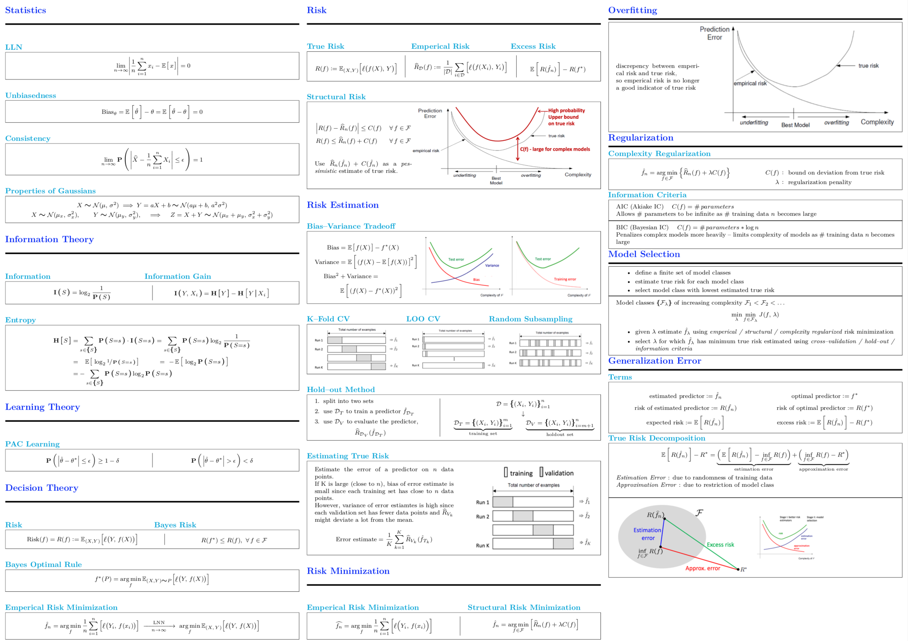

# Custom LaTeX Packages
....

## Installation

### install mactex
 - `brew tap caskroom/cask`
 - `brew cask install mactex`

### install the latex-repository
#### create the texmf/latex directory.
```
> cd ~/library
> mkdir texmf
> mkdir texmf/tex
```
#### clone the repository
(option 1): Clone the repo into `~/library/texmf/tex/<latex-repo-here>`
```
> git clone https://github.com/jakeparker/latex.git ~/library/texmf/tex
```
(option 2): Clone the repo somewhere else
```
> git clone https://github.com/jakeparker/latex.git ~\<local-path-here>
> ln -s ~/<local-path-here>/latex ~/library/texmf/tex/latex
```

## Overview
This repo defines two latex packages (`macros`, `theorems`), and three document classes (`cheatsheet`, `homework`, `notes`):

* `macros` is a collection of various custom latex commands that I have added to over the years.
* `theorems` is a simple wrapper around various latex theorem packages, that allows one to easily switch between different backend latex theorem packages, and to easily switch between theorem styles for a given backend. *(Caveat: almost entirely hard-coded, as I wrote it for myself...  ¯\\\_(ツ)_/¯ ...)*
* `cheatsheet` provides a cheatsheet environment, based off of [this probability cheatsheet](http://www.wzchen.com/probability-cheatsheet/).
* `homework` ignore this... it doesn't work... not even close... *(Note: it was a very brief attempt at standardizing document headers for different classes, so I wouldn't have to copy an paste the header of the previous assignment when starting to typeset the next assignment...)*
* `notes` custom class for note taking -- see example below


## Usage
```latex
% in some *.tex file
\documentclass{...}  % one of <cheatsheet>, <homework>, or <notes>, etc...
\usepackage{...}  % some of <macros>, <theorems>, etc...

...

\begin{document}
  % <body>
\end{document}
```

## Examples

### macros
Example using: `\Prob{}`, `\Exp{}`, `\Entropy{}`, `\Information{}`, `\Set{}`, `\argmin`, `\argmax`

<details><summary>code</summary>
<p>

```latex
% in some *.tex file
\documentclass[a4paper, fleqn]{article}
\newcounter{chapter}[chapter] % macros.sty expects this counter to be defined -- if not using notes.cls, should define it manually.

\usepackage{macros}

% ...

\begin{document}
  \vspace{-2\baselineskip}\horizontal[5mm]

  \begin{minipage}{0.5\textwidth}
    Information is defined as,\\
    {\vspace{-1.5\baselineskip}\begin{align*}
      \Information{S} &= \log_2 \frac{1}{\Prob{S}}
    \end{align*}}
  \end{minipage}%
  \begin{minipage}{0.5\textwidth}
    Information Gain is defined as,\\
    {\vspace{-1.5\baselineskip}\begin{align*}
      \Information{Y,\, X_i} &= \Entropy{Y} - \Entropy{Y \given X_i}
    \end{align*}}
  \end{minipage}

  \vspace{-1.5\baselineskip}Entropy is defined as,\\
  {\vspace{-1.5\baselineskip}\begin{align*}
    \Entropy{S} &= \sum_{s \in \Set{S}} \Prob{S{=}s} \cdot \Information{S{=}s} = \sum_{s \in \Set{S}} \Prob{S{=}s} \log_2 \frac{1}{\Prob{S{=}s}} \\
                &=\quad\! \Exp{\log_2 \sfrac{1}{\Prob{S{=}s}}}\qquad\quad\, =\ {-} \Exp{\log_2 \Prob{S{=}s}} \\
                &= {-} \sum_{s \in \Set{S}} \Prob{S{=}s} \log_2 \Prob{S{=}s}
  \end{align*}}

  \vspace{-\baselineskip}\horizontal[5mm]
  \vspace{-2\baselineskip}\begin{align*}
    \argmax_{X_i} \Big\lbrack \Entropy{Y} - \Entropy{Y \given X_i} \Big\rbrack
      &= \argmin_{X_i} \Entropy{Y \given X_i} \\
      &= \argmin_{X_i} \sum_{x \in \Set{X_i}} \Big\lbrack \Prob{X_i{=}x} \Entropy{Y \given X_i{=}x} \Big\rbrack \\
      &= \argmin_{X_i} {-} \sum_{x \in \Set{X_i}} \bigg\lbrack \Prob{X_i{=}x} \sum_{y \in \Set{Y}} \Big\lbrack \Prob{Y{=} \given X_i{=}x} \log_2 \Prob{Y{=}y \given X_i{=}x} \Big\rbrack \bigg\rbrack
  \end{align*}

  \horizontal
\end{document}
```

</p>
</details>



Example using: `\Prob{}`, `\given`, `\by`

<details><summary>code</summary>
<p>

```latex
% in some *.tex file
\documentclass[a4paper, fleqn]{article}
\newcounter{chapter}[chapter] % macros.sty expects this counter to be defined -- if not using notes.cls, should define it manually.

\usepackage{macros}

% ...

% https://tex.stackexchange.com/questions/73160/table-with-tabularx-and-multirow
\usepackage{array, makecell, multirow, tabularx}
\renewcommand\theadfont{\normalsize\bfseries}
\renewcommand{\arraystretch}{.0001}

% ...

\begin{document}
  \begin{center}
    \makebox[0pt][c]{%
      \hskip-\footskip
      \begin{tabularx}{\hsize}{|X|X|}
        \hline
        {\begin{align*} T & \sim N(\mu_0,\ \sigma_0^2) \\ &= \Prob{T \by \mu_0,\ \sigma_0} \\ &= \frac{1}{\sqrt{2\pi\sigma_0^2}} \exp \left\{ \frac{- {(t - \mu_0)}^2}{2\sigma_0^2} \right\} \end{align*}} & {\begin{align*} \forall\ i \in [k].\ \exists\ \text{i.d.}\ & \text{r.v.}\ \epsilon_i \sim N(\mu_i,\ \sigma_i^2) \\ \Prob{\epsilon_i \by \mu_i,\ \sigma_i} &= \frac{1}{\sqrt{2\pi\sigma_i^2}} \exp \left\{ \frac{- {(\epsilon_i - \mu_i)}^2}{2\sigma_i^2} \right\} \end{align*}} \\
        \hline
        {\begin{align*} & M \given T\ \sim\ N(t + \Sigma \mu_i,\ \Sigma \sigma_i^2)\\ &= \Prob{M = t + \sum_{i=1}^k \epsilon_i\ \given T=t \by t + \sum_{i=1}^k \mu_i,\ \sum_{i=1}^k \epsilon_i^2} \\ &= \frac{1}{\sqrt{2\pi\Sigma \sigma_i^2}} \exp \left\{ \frac{-{(m - (t + \Sigma \mu_i))}^2}{2 \Sigma \sigma_i^2} \right\} \end{align*}} & {\begin{align*} \Sigma \epsilon_i\ &\sim\ N(\Sigma \mu_i,\ \Sigma \sigma_i^2) \\ &= \Prob{\sum_{i=1}^k \epsilon_i \by \sum_{i=1}^k \mu_i,\ \sum_{i=1}^k \sigma_i^2} \\ &= \frac{1}{\sqrt{2\pi\Sigma \sigma_i^2}} \exp \left\{ \frac{-{(\Sigma \epsilon_i - \Sigma \mu_i)}^2}{2\Sigma \sigma_i^2} \right\} \end{align*}} \\
        \hline
      \end{tabularx}%
      \hskip\headheight
    }
  \end{center}
\end{document}
```

</p>
</details>



### theorems + notes

Notes example using theorems. Example splits notes into a top-level `notes.tex` which includes each `notes_X.Y.tex` for chapter `X` section `Y`, alternatively one can use this pattern to organize lecture notes, etc.

<details><summary>code</summary>
<p>

```latex
% notes_3.6.tex
\documentclass[12pt, a4paper, oneside, fleqn]{notes}
\usepackage[style=boxed]{theorems}  % change style=<...> to switch between pre-defined theorem styles/backends
\usepackage{letters}

\usepackage{etex}

\usepackage[linktoc=all]{hyperref}
\hypersetup{pdftex,colorlinks=false}
\usepackage{hypcap}

\usepackage{enumerate, enumitem, extramarks, linegoal, graphicx, fancyhdr}
\usepackage{amsmath}

\begin{document}
  \subsection{Linear Transformations}
  %\addcontentsline{toc}{subsection}{Linear Transformations}

  \begin{defn*}
  	A transformation \(T: \R^{n} \ra \R^{m}\) is called a \textbf{linear transformation} if
  	\begin{itemize}
  		\item[1.]	\(T(\mathbf{u} + \mathbf{v}) = T(\mathbf{u}) + T(\mathbf{v})\) for all \(\mathbf{u}\) and \(\mathbf{v}\) in \(\R^{n}\) and
  		\item[2.]	\(T(c\mathbf{v}) = cT(\mathbf{v})\) for all \(\mathbf{v}\) in \(\R^{n}\) and all scalars \(c\).
  	\end{itemize}
  \end{defn*}


  \begin{remark*}
  	The definition of a linear transformation can be streamlined by combining (\(1\)) and (\(2\)) as shown below \vspace{2mm}\\
  	\(T: \R^{n} \ra \R^{m}\) is a linear transformation if
  	\center
  	\(
  		T(c_{1}\mathbf{v_{1}} + c_{2}\mathbf{v_{2}}) = c_{1}T(\mathbf{v_{1}}) + c_{2}T(\mathbf{v_{2}}) \text{ for all } \mathbf{v_{1}}, \mathbf{v_{2}} \text{ in } \R^{n} \text{ and scalars } c_{1}, c_{2}
  	\)
  \end{remark*}


  \begin{thm}
  	Let \(A\) be an \(m \times n\) matrix. Then the matrix transformation \(T_{A}:\R^{n} \ra \R^{m}\) defined by
  			\[
  				T_{A}(\mathbf{x}) = A\mathbf{x}\ (\text{for } \mathbf{x} \text{ in } \R^{n})
  			\]
  	is a linear transformation.
  \end{thm}


  \begin{thm}
  	Let \(T_{A}:\R^{n} \ra \R^{m}\) be a linear transformation. Then \(T\) is a matrix transformation. \\
  	More specifically, \(T = T_{A}\), where \(A\) is the \(m \times n\) matrix
  			\[ A =
  				\begin{bmatrix}
  					T(\mathbf{e_{1}}) & \vdots & T(\mathbf{e_{2}}) & \vdots & \ldots & \vdots & T(\mathbf{e_{n}}) \\
  				\end{bmatrix}
  			\]
  \end{thm}
\end{document}
```

```latex
\documentclass[12pt, a4paper, oneside, fleqn]{notes}
\usepackage[style=boxed]{theorems}
\usepackage{macros}
\usepackage{letters}

\usepackage{etex}

\usepackage[linktoc=all]{hyperref}
\hypersetup{pdftex,colorlinks=false}
\usepackage{hypcap}

\usepackage{enumerate, enumitem, extramarks, linegoal, graphicx, fancyhdr}
\usepackage{amsmath}

\newcommand{\Title}{title}
\newcommand{\Date}{year}
\newcommand{\Class}{course number}
\newcommand{\ClassName}{course name}
\newcommand{\Name}{author}

\pagestyle{fancyplain}
\lhead{\fancyplain{}{\Class}}
\chead{\fancyplain{}{\ClassName}}
\rhead{\fancyplain{}{\Title}}


%%%%%%%%%%%%%%%%%%%%%%%%%%%%%%%%%%%%%%%%%%%%%%%%%%%%

\begin{document}

\tableofcontents

% ...

% [3] Matrices
\chapter{Matrices}
\include{notes_3.6}

\end{document}
```

</p>
</details>



### cheatsheet


